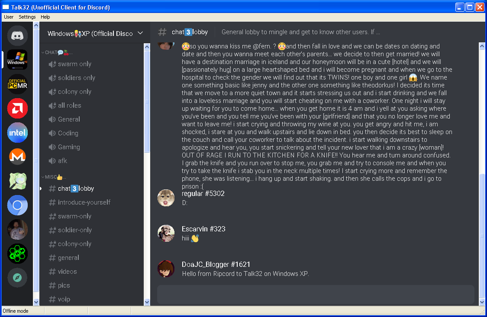

# Talk32
A lightweight unofficial Discord client that uses only Win32, GDI, and GDI+ for rendering instead of Chrome/Electron. To support modern TLS on Windows XP it uses OpenSSL and provides its own root certificates.

This project is compiled with version 7.1 of the Windows SDK.

#### How to run
1. Build or obtain a release
2. If you downloaded a copy of talk32.exe, put it in the repository folder
3. Run talk32.exe and then close it.
4. The program only reads cached server data at the moment so download a copy of cache.7z
5. Extract cache.7z so the "cache" folder is in your AppData\Talk32 folder (for example, C:\Users\777\AppData\Talk32)
6. Run talk32.exe again and choose Offline Mode.

#### How to build
1. Open the Windows SDK 7.1 command prompt.
2. Run the command **setenv /xp /x86 /release**
3. Change to the repository folder with **cd [folder path]**
4. Run **nmake**
5. The result will be a file called talk32.exe

#### Known issues
- Doesn't connect to Discord yet
- Server icons and user avatars are shown in low color
- Sometimes the server name in the left sidebar disappears on Windows XP